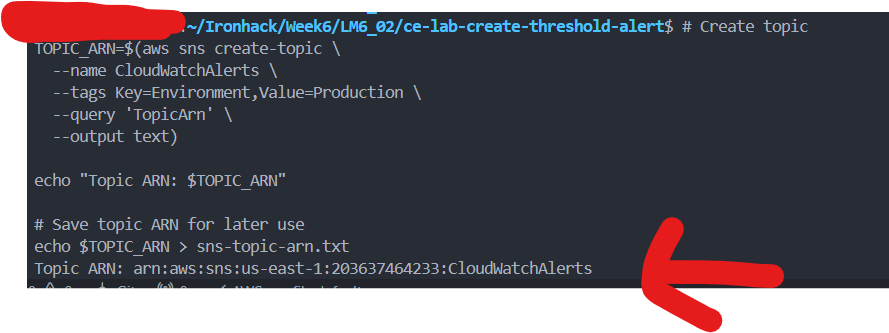
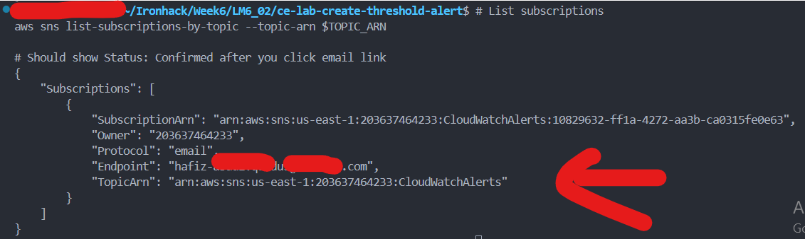
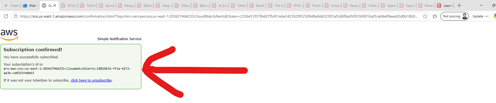
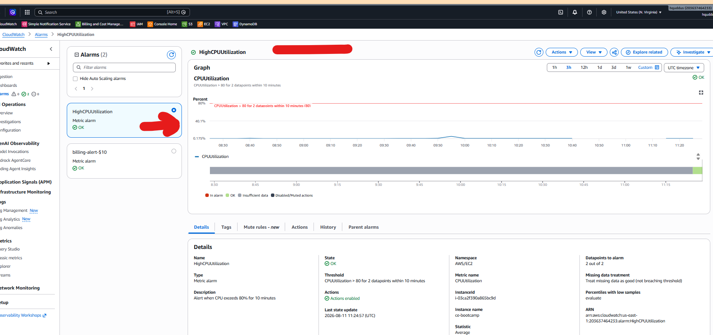
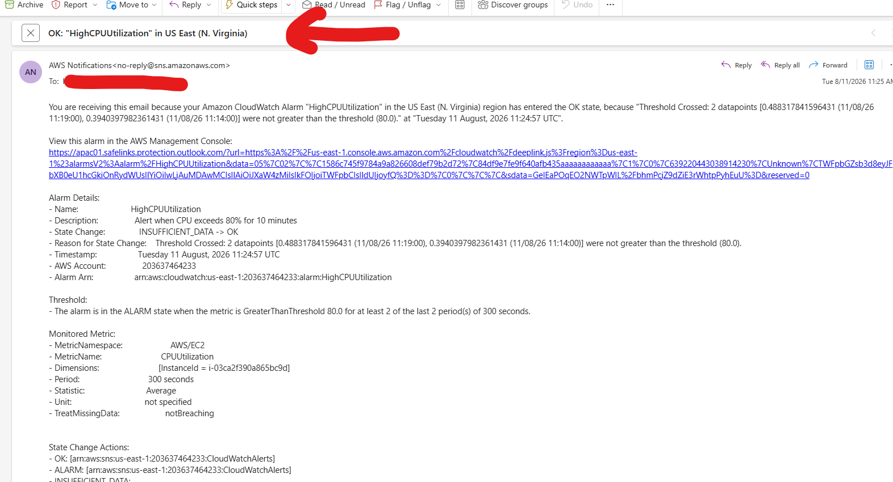
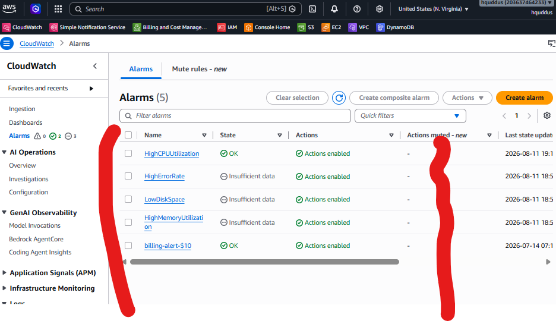
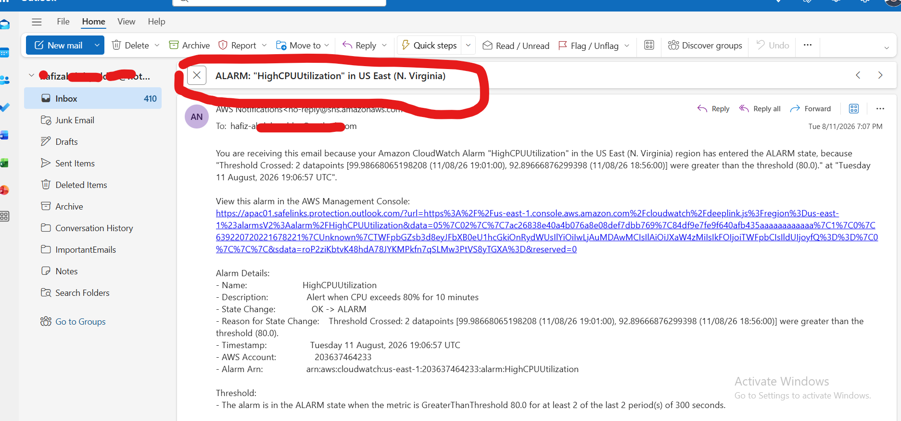
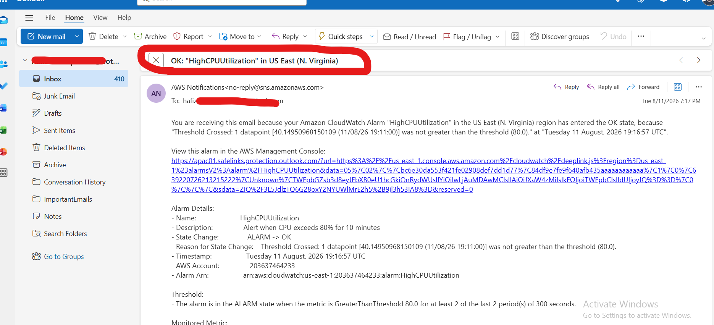

# SOLUTION.md — Lab M6.02: Create Basic Threshold Alert


**Repository:** [github.com/HafizAQ/ce-lab-create-threshold-alert](https://github.com/HafizAQ/ce-lab-create-threshold-alert)

**Name** Hafiz Abdul Quddus
**Date:** 11-08-2026

## Overview

This lab configured Amazon CloudWatch alarms for an EC2 instance and used Amazon SNS to send email notifications when thresholds were breached.

The main alarm, `HighCPUUtilization`, was successfully created, triggered into the **ALARM** state during a CPU stress test, sent an email notification, and later returned to the **OK** state.

> Note: The lab instructions expected an EC2 instance tagged `Name=logging-lab`, but my running instance was tagged `Name=ce-bootcamp`.

---

## 1. SNS Topic and Email Subscription

Created the SNS topic:

```bash
TOPIC_ARN=$(aws sns create-topic \
  --name CloudWatchAlerts \
  --tags Key=Environment,Value=Production \
  --query 'TopicArn' \
  --output text)

echo "$TOPIC_ARN"
```

Subscribed an email address:

```bash
aws sns subscribe \
  --topic-arn "$TOPIC_ARN" \
  --protocol email \
  --notification-endpoint <EMAIL_ADDRESS>
```

The subscription was confirmed using the link received by email.

Verification:

```bash
aws sns list-subscriptions-by-topic \
  --topic-arn "$TOPIC_ARN"
```

### Screenshots

**SNS topic created**



**Email subscription confirmed — CLI verification**



**Email subscription confirmed — browser**



---

## 2. EC2 Instance Selection

The original filter returned `None` because my instance tag was `ce-bootcamp`, not `logging-lab`.

I verified the running instance with:

```bash
aws ec2 describe-instances \
  --region us-east-1 \
  --filters "Name=instance-state-name,Values=running" \
  --query 'Reservations[].Instances[].{ID:InstanceId,Name:Tags[?Key==`Name`]|[0].Value}' \
  --output table
```

Then exported the instance ID:

```bash
export INSTANCE_ID="i-03ca2f390a865bc9d"
export TOPIC_ARN="arn:aws:sns:us-east-1:<ACCOUNT_ID>:CloudWatchAlerts"
```

---

## 3. High CPU Alarm

Created the CPU alarm:

```bash
aws cloudwatch put-metric-alarm \
  --region us-east-1 \
  --alarm-name HighCPUUtilization \
  --alarm-description "Alert when CPU exceeds 80% for 10 minutes" \
  --metric-name CPUUtilization \
  --namespace AWS/EC2 \
  --statistic Average \
  --period 300 \
  --threshold 80 \
  --comparison-operator GreaterThanThreshold \
  --evaluation-periods 2 \
  --dimensions Name=InstanceId,Value="$INSTANCE_ID" \
  --alarm-actions "$TOPIC_ARN" \
  --ok-actions "$TOPIC_ARN" \
  --treat-missing-data notBreaching
```

Configuration:

- Metric: `CPUUtilization`
- Namespace: `AWS/EC2`
- Threshold: **80%**
- Period: **300 seconds**
- Evaluation periods: **2**
- Alarm condition: CPU > 80% for two evaluation periods
- Notification: SNS topic `CloudWatchAlerts`

Verification:

```bash
aws cloudwatch describe-alarms \
  --alarm-names HighCPUUtilization
```

### Screenshots

**HighCPUUtilization alarm in OK state**



**OK state email notification**



---

## 4. Additional Alarms

Additional alarms were created for:

- `HighMemoryUtilization`
- `LowDiskSpace`
- `HighErrorRate`

Example memory alarm:

```bash
aws cloudwatch put-metric-alarm \
  --alarm-name HighMemoryUtilization \
  --alarm-description "Alert when memory exceeds 85%" \
  --metric-name mem_used_percent \
  --namespace CWAgent \
  --statistic Average \
  --period 300 \
  --threshold 85 \
  --comparison-operator GreaterThanThreshold \
  --evaluation-periods 2 \
  --dimensions Name=InstanceId,Value="$INSTANCE_ID" \
  --alarm-actions "$TOPIC_ARN"
```

At the time of the screenshot, these additional alarms were in **INSUFFICIENT_DATA**, while the CPU alarm had valid EC2 metric data.

### Screenshot

**CloudWatch alarms overview**



---

## 5. Testing the CPU Alarm

CPU load was generated on the EC2 instance so that utilization exceeded 80%.

Example:

```bash
sudo dnf install -y stress
stress --cpu 4 --timeout 900s
```

The alarm changed:

```text
OK -> ALARM
```

and AWS SNS delivered an email notification showing that two datapoints exceeded the 80% threshold.

After the stress test ended and CPU utilization dropped, the alarm changed back:

```text
ALARM -> OK
```

and an OK notification email was received.

### Screenshots

**CPU alarm triggered after the stress test**



**SNS email received for the ALARM state**



**Recovery notification after CPU returned below the threshold**


---

## 6. Alarm States Observed

### OK

The metric is within the configured threshold.

### ALARM

The metric breached the configured threshold for the required evaluation periods.

### INSUFFICIENT_DATA

CloudWatch does not yet have enough matching metric data to evaluate the alarm.

The CPU alarm successfully demonstrated both **ALARM** and **OK** transitions.

---

## Challenges and Solutions

### 1. EC2 instance query returned `None`

**Cause:** The lab expected `Name=logging-lab`, but the running instance was tagged `Name=ce-bootcamp`.

**Solution:** Listed running instances, identified the correct instance ID, and exported it manually.

### 2. Invalid SNS ARN

The variable initially contained only:

```text
arn:aws:sns:us-east-1:<ACCOUNT_ID>
```

This is incomplete.

**Solution:** Used the complete topic ARN:

```text
arn:aws:sns:us-east-1:<ACCOUNT_ID>:CloudWatchAlerts
```

### 3. Empty `INSTANCE_ID`

The memory alarm initially failed because `$INSTANCE_ID` was empty.

**Solution:**

```bash
export INSTANCE_ID="i-03ca2f390a865bc9d"
```

### 4. Additional alarms showed `INSUFFICIENT_DATA`

CPU metrics come directly from EC2, but memory and disk metrics require CloudWatch Agent metric collection with dimensions that match the alarms. Log-based error metrics also require new matching log events after the metric filter is created.

---

## Reflection Questions

### 1. Why use two evaluation periods instead of one?

Two periods reduce false alarms caused by short CPU spikes. The threshold must remain breached long enough to represent a persistent issue.

### 2. Difference between Average, Maximum and P95?

- **Average** shows overall behavior but may hide spikes.
- **Maximum** captures the highest value and is very sensitive.
- **P95** shows the value below which 95% of observations fall and is useful for latency monitoring.

### 3. When should OK actions be used?

Use OK actions when users or operators should be informed that a previously detected problem has recovered.

### 4. How should thresholds be selected?

Observe normal workload behavior first, then choose thresholds that detect abnormal conditions while avoiding unnecessary alerts.

### 5. What affects CloudWatch alarm cost?

Cost depends on alarm type, metric resolution, region, and the number of alarms/metrics monitored. In production, current AWS CloudWatch pricing should be checked before deployment.

---

## Screenshot Evidence Summary

The following screenshots are included in the repository under `screenshots/` and are embedded above:

1. `01-sns-topic.png` — SNS topic `CloudWatchAlerts` created.
2. `02-email-confirmation-cli.png` — confirmed SNS subscription shown by AWS CLI.
3. `02-email-confirmation-web.png` — SNS subscription confirmation page.
4. `03-alarm-ok-state-console.png` — `HighCPUUtilization` in the OK state.
5. `03-alarm-ok-state-email.png` — OK/recovery notification received by email.
6. `04-alarm-alarm-state.png` — ALARM notification after CPU exceeded 80%.
7. `05-email-notification.png` — CloudWatch/SNS notification evidence.
8. `06-alarms-aws.png` — CloudWatch alarms overview, including additional alarms.

## Result

The core success criteria were achieved:

- SNS topic created
- Email subscription confirmed
- CloudWatch CPU alarm created
- CPU threshold deliberately breached
- Alarm changed to **ALARM**
- Email notification received
- Alarm returned to **OK**
- Recovery email received

The screenshots provide evidence of the SNS configuration, confirmed subscription, CloudWatch alarm states, and received notifications.
